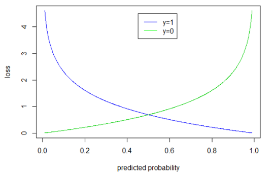
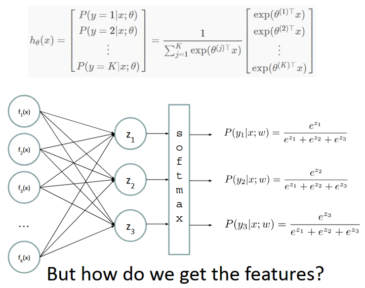
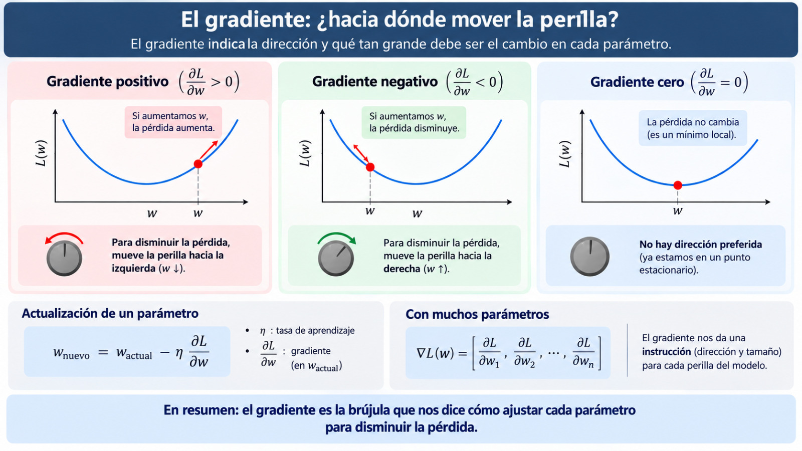
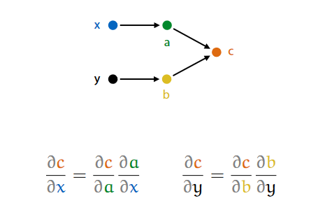
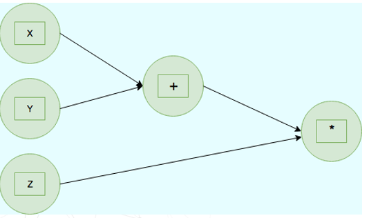
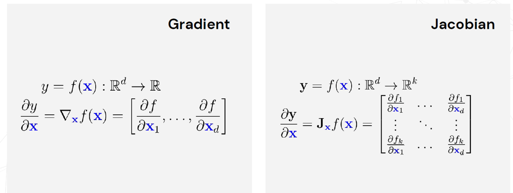
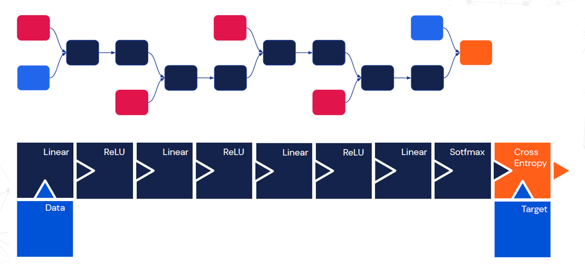

class: middle, center, title-slide

# SI3003 - Inteligencia Artificial

Clase 7 — Regresión Lineal, Clasificadores Lineales y Redes Neuronales

  

???

Hasta ahora los agentes que estudiamos decidían: buscaban, planificaban,
o aprendían por recompensas. Hoy cambiamos de pregunta: en vez de
*decidir*, el modelo va a **aproximar una función** a partir de datos
etiquetados. Empezamos con el caso más simple posible —una recta— y de
ahí, sin cambiar la idea de fondo, llegamos a las redes neuronales
profundas.

El hilo de toda la clase es uno solo: *modelo + función de costo +
entrenamiento*. La regresión lineal lo introduce, el clasificador lineal
lo reutiliza cambiando la salida, y la DNN lo apila en capas. Si los
estudiantes se llevan ese esquema, el resto es notación.

---

### Hoy

.grid[
.kol-1-2[
- De los datos al modelo: notación y función de costo
- **Regresión Lineal**
    - El modelo y su forma vectorial
    - El error y la función objetivo
    - Entrenamiento: gradiente y ecuación normal
- **Clasificadores Lineales**
    - El perceptrón de umbral
    - Regla de decisión binaria e hiperplano
    - Regla de aprendizaje y convergencia
- **Redes Neuronales y DNN**
    - De la regresión logística a la neurona
    - Sigmoide, softmax y multiclase
    - Arquitectura profunda y activaciones
    - Backpropagation
    - Aproximadores universales
]
.kol-1-2[
.center.width-70[]
]
]

???

Ojo con el orden: no es casual. Regresión lineal → clasificador lineal →
red neuronal es literalmente la misma neurona, cambiándole la función de
salida y luego apilándola. Vale la pena anunciarlo desde el principio.

---

class: middle, center, divider-slide

## Parte 1 — Regresión Lineal

---

class: smaller

# Notación matemática

Antes del modelo, fijemos el lenguaje. Un conjunto de datos es una tabla:
cada .bold[fila] es un ejemplo y cada .bold[columna] es una característica
(*feature*).

.center.width-70[]

- $\mathbf{x}^{(i)} \in \Re^{d \times 1}$: el .bold[vector de características] del ejemplo $i$ (sus $d$ columnas).
- $\mathbf{X} \in \Re^{n \times d}$: la .bold[matriz de características], con los $n$ ejemplos apilados por filas.
- $y^{(i)}$: la .bold[etiqueta]. Si $y^{(i)} \in \Re$ el problema es de .italic[regresión]; si $y^{(i)} \in [0, 1, \cdots, C]$ es de .italic[clasificación].

???

El dataset del ejemplo es *California Housing*: cada fila es un distrito y
`median_house_value` es lo que queremos predecir. Es útil señalar que
`ocean_proximity` es categórica — todavía no es un número, y eso ya
anticipa el problema de "cómo construyo mis features".

---

class: smaller

# Métodos de aprendizaje de máquina

Todo método de aprendizaje supervisado se reduce a dos objetos:

- Una .bold[hipótesis] $f$ que aproxima la relación entre $\mathbf{x}^{(i)}$ y $y^{(i)}$.
- Una .bold[función de costo] $\mathcal{L}$ que mide qué tan mal lo está haciendo.

.center.width-40[]

.alert[**Aprender** = elegir los parámetros de $f$ que minimizan
$\mathcal{L}$ sobre los datos de entrenamiento. Todo lo que veremos hoy
cambia *quién es $f$* y *quién es $\mathcal{L}$*, pero nunca cambia esta receta.]

???

Este es el slide más importante de la primera mitad. Vale la pena
detenerse: lo único que distingue a la regresión lineal de una red
neuronal de 100 capas es la forma de $f$. La maquinaria de optimización
es la misma.

---

class: smaller

# Regresión Lineal: Modelo

La hipótesis más simple posible: una .bold[combinación lineal] de las
características, más un término independiente $w\_0$ (el .italic[sesgo] o
*bias*).

.center.width-70[]

Absorbiendo el sesgo dentro del vector de pesos —agregando una entrada
constante $1$ al vector de características— el modelo se escribe como un
solo producto punto.

.alert[Fíjense en el diagrama de la derecha: entradas, pesos, una suma y
una salida. Eso **ya es una neurona artificial**. La regresión lineal es
una red neuronal de una sola unidad, sin función de activación.]

---

class: smaller

# Regresión Lineal: Error en la función objetivo

Para cada ejemplo, el .bold[error] (o *residuo*) es la distancia vertical
entre el valor real $y\_i$ y el valor predicho $\hat{y}\_i$ por la recta.

.center.width-50[]

Ningún conjunto de pesos elimina todos los errores a la vez. Lo que sí
podemos hacer es buscar la recta que los deja .bold[lo más pequeños
posible en conjunto].

???

Pregunta para la clase: ¿por qué elevar al cuadrado y no tomar valor
absoluto? Dos razones: (a) penaliza más los errores grandes, y (b) es
derivable en todo punto, lo que hace posible el descenso por gradiente
del siguiente slide. El valor absoluto no es derivable en cero.

---

class: middle, smaller

# Regresión Lineal: Función Objetivo

Sumamos los errores .bold[al cuadrado] sobre los $n$ ejemplos y
promediamos. Ese es el .italic[error cuadrático medio]:

$$Cost\_{\mathbf{w}} = \frac{1}{m}\sum\_{i=1}^{n}\left(y\_i - \mathbf{w}^T\begin{bmatrix}\mathbf{x}\_i\\\\ 1\end{bmatrix}\right)^2$$

Entrenar la regresión lineal es .bold[minimizar esta función respecto a
$\mathbf{w}$]. Es un problema de optimización convexo: tiene un único
mínimo global, sin mínimos locales donde quedarse atrapado.

---

class: smaller

# Regresión Lineal: Entrenamiento

Hay dos caminos para llegar al mismo $\mathbf{w}$ óptimo:

.center.width-70[]

- .bold[Descenso por el gradiente]: iterativo. Damos pasos de tamaño $\alpha$ (la .italic[tasa de aprendizaje]) en la dirección contraria al gradiente, hasta converger. Escala bien a muchos datos y a muchas dimensiones.
- .bold[Ecuación normal]: solución cerrada. Un solo cálculo da la respuesta exacta, pero requiere invertir $\mathbf{X}^T\mathbf{X}$ — costoso cuando $d$ es grande.

.alert[En redes neuronales la ecuación normal no existe, pero el gradiente sí.]

???

$\alpha$ demasiado grande → el entrenamiento diverge (los pesos oscilan y
explotan). $\alpha$ demasiado pequeño → converge, pero tarda una
eternidad. Es el primer hiperparámetro que van a tener que ajustar a mano.

---

class: middle, center, divider-slide

## Parte 2 — Clasificadores Lineales

---

class: smaller

# El perceptrón de umbral como clasificador lineal

¿Y si en vez de predecir un número queremos predecir una .bold[clase]?
La idea se conserva casi entera: seguimos calculando $\mathbf{w} \cdot
\mathbf{x}$, pero ahora, en vez de reportar ese número, lo comparamos
contra un .bold[umbral].

.center.width-70[]

El resultado es una .bold[frontera de decisión] que parte el espacio en
dos: de un lado los ejemplos positivos, del otro los negativos.

.footnote[Créditos: CS188 — *Introduction to Artificial Intelligence*, UC Berkeley.]

---

class: smaller

# Regla de decisión binaria

.grid[
.kol-1-2[
Un .bold[perceptrón de umbral] es una sola unidad que produce:

$$y = h\_{\mathbf{w}}(\mathbf{x}) = \begin{cases} 1 & \text{si } \mathbf{w} \cdot \mathbf{x} \geq 0 \\\\ 0 & \text{si } \mathbf{w} \cdot \mathbf{x} < 0 \end{cases}$$

En el espacio vectorial de entrada:

- Los ejemplos son .bold[puntos] $\mathbf{x}$.
- La ecuación $\mathbf{w} \cdot \mathbf{x} = 0$ define un .bold[hiperplano].
- Un lado corresponde a $y=1$.
- El otro lado corresponde a $y=0$.
]
.kol-1-2[
.center.width-80[]
]
]

.footnote[Créditos: CS188 — UC Berkeley. Ejemplo: clasificar correo en *SPAM* ($y=1$) vs. *HAM* ($y=0$).]

???

El ejemplo del gráfico es un filtro de spam con solo dos características:
cuántas veces aparece la palabra *free* y cuántas veces aparece *money*.
Los pesos son $w\_0 = -3$, $w\_{free} = 4$, $w\_{money} = 2$: el sesgo
negativo dice "por defecto asume que NO es spam", y las dos palabras
empujan hacia spam.

---

class: middle, smaller

# Ejemplo

.center.width-70[]

El correo contiene *free* y *money*, así que $\mathbf{x} = (1, 1, 1)$.
Con $\mathbf{w} = (-3, 4, 2)$:
$\;\mathbf{w} \cdot \mathbf{x} = -3 + 4 + 2 = 3 \geq 0 \Rightarrow y = 1$
(SPAM).

.footnote[Créditos: CS188 — UC Berkeley.]

???

Vale la pena leer el correo en voz alta: es de Bill (Gates) a Stuart
(Russell), y es legítimo — pero el clasificador lo marca como spam
porque contiene "money" y "free". Ese es un **falso positivo**, y es
justo el error que la regla de aprendizaje del siguiente slide va a
corregir.

---

class: smaller

# Regla de aprendizaje del perceptrón

Si la etiqueta real $y$ difiere de la predicción $h\_{\mathbf{w}}(\mathbf{x})$, hubo un error y hay que ajustar los pesos:

- Si $\mathbf{w} \cdot \mathbf{x} < 0$ pero la salida debía ser $y=1$ — un .bold[falso negativo]:
    - Aumentar los pesos de las entradas positivas.
    - Disminuir los pesos de las entradas negativas.
- Si $\mathbf{w} \cdot \mathbf{x} > 0$ pero la salida debía ser $y=0$ — un .bold[falso positivo]:
    - Disminuir los pesos de las entradas positivas.
    - Aumentar los pesos de las entradas negativas.

La .bold[regla de aprendizaje del perceptrón] hace exactamente eso en una sola línea:

$$\mathbf{w} \leftarrow \mathbf{w} + \alpha\,(y - h\_{\mathbf{w}}(\mathbf{x}))\,\mathbf{x}$$

donde $\alpha$ es la .italic[tasa de aprendizaje] y el factor
$(y - h\_{\mathbf{w}}(\mathbf{x}))$ vale $+1$, $-1$ o $0$ (si no hay
error, no hay actualización).

.footnote[Créditos: CS188 — UC Berkeley.]

???

Retomando el ejemplo anterior con $\alpha = 0.5$: era un falso positivo
($y=0$, predicción $1$), así que
$\mathbf{w} \leftarrow (-3,4,2) + 0.5\,(0-1)\,(1,1,1) = (-3.5, 3.5, 1.5)$.
La frontera se mueve, y ese correo queda del lado correcto.

Noten el parecido estructural con el descenso por gradiente de la
primera parte: peso nuevo = peso viejo + tasa × error × entrada.

---

class: smaller

# Teorema de convergencia del perceptrón

.grid[
.kol-3-5[
Un problema de aprendizaje es .bold[linealmente separable] si y solo si
existe algún hiperplano que separa .italic[exactamente] los ejemplos
positivos de los negativos.

.bold[Convergencia]: si los datos de entrenamiento son separables,
aplicar repetidamente la regla de aprendizaje del perceptrón sobre el
conjunto de entrenamiento converge, tarde o temprano, a un separador
perfecto.
]
.kol-2-5[
.center.width-70[]

.center[.italic[Un caso .bold[separable]: existe un hiperplano que deja
todos los $+$ de un lado y todos los $-$ del otro.]]
]
]

.alert[El problema es la letra pequeña: **si son separables**. La mayoría
de problemas reales no lo son, y ahí el perceptrón nunca se estabiliza.
Esa limitación es exactamente la que motiva el resto de la clase.]

.footnote[Créditos: CS188 — UC Berkeley.]

???

Aquí es donde históricamente se estancó el campo: Minsky y Papert (1969)
mostraron que un perceptrón no puede aprender ni siquiera el XOR, porque
no es linealmente separable. Esa publicación congeló la investigación en
redes neuronales por más de una década. La salida —apilar capas— es a
donde vamos ahora.

---

class: smaller

# La función de costo para clasificar: entropía cruzada

El perceptrón tiene modelo y regla de aprendizaje, pero le falta la pieza
central de la receta: .bold[una función de costo que podamos minimizar].
Su umbral duro responde $0$ o $1$, y eso no es derivable.

El arreglo es hacer que el clasificador devuelva una .bold[probabilidad]
$h\_\theta(\mathbf{x})$ entre $0$ y $1$ en lugar de una etiqueta —de eso se
encarga la sigmoide, que veremos en la Parte 3—. Con una probabilidad a la
salida sí podemos escribir un costo, y no es el error cuadrático: lo que
queremos castigar no es la distancia sino la .italic[confianza equivocada].
Esa función es la .bold[entropía cruzada] (*cross-entropy*, o *log loss*):

.center.width-80[]

- $h\_\theta(x^{(i)})$ es la probabilidad predicha para el ejemplo $i$, $y^{(i)}$ vale $0$ o $1$, y $\theta$ son los pesos —la $\mathbf{w}$ de siempre—.
- Por cada ejemplo sobrevive .bold[un solo] término: si $y^{(i)}=1$ queda $-\log h\_\theta(x^{(i)})$; si $y^{(i)}=0$ queda $-\log(1 - h\_\theta(x^{(i)}))$.

.alert[Miren la segunda ecuación: el gradiente vuelve a tener la forma
**error × entrada**, la misma de la regresión lineal y la misma de la regla
del perceptrón. Cambia la función de costo; la maquinaria de entrenamiento
no cambia.]

???

Aquí conviene volver al slide de "Métodos de aprendizaje de máquina": lo
que estamos haciendo es rellenar la casilla $\mathcal{L}$ para el caso de
clasificación. La casilla $f$ la completaremos en la Parte 3, cuando la
sigmoide reemplace al umbral duro — pero el costo de este slide ya no
cambia a partir de ahí.

La pregunta obligada es por qué no error cuadrático. Dos razones, y la
segunda es la fuerte: (a) acota el castigo —equivocarse con toda la
confianza cuesta a lo sumo 1—, y (b) combinado con la sigmoide produce una
función de costo .bold[no convexa], llena de mínimos locales. Con entropía
cruzada la función vuelve a ser convexa, y además el gradiente se
simplifica hasta la expresión de la segunda ecuación.

---

class: middle, smaller

# Entropía cruzada: cómo se comporta

.grid[
.kol-1-2[
.center.width-100[]
]
.kol-1-2[
Léanla curva por curva:

- .bold[Azul ($y=1$)]: si el modelo predice una probabilidad cercana a $1$, el costo es casi $0$; a medida que la probabilidad baja hacia $0$, el costo .bold[crece sin límite].
- .bold[Verde ($y=0$)]: exactamente el espejo.
- Las dos se cruzan en $p=0.5$, con costo $\log 2 \approx 0.69$: el precio de .italic[no saber nada].
]
]

.alert[La asíntota es lo importante: equivocarse **con confianza** cuesta
infinito. Eso es lo que empuja al modelo no solo a acertar la clase, sino a
estar seguro cuando acierta.]

???

Este $0.69$ es un número práctico que vale la pena que se lleven: cuando
entrenen y la pérdida se quede estancada en $0.69$, el modelo no está
aprendiendo nada —está devolviendo $0.5$ para todo—. Es el primer
diagnóstico que uno hace al mirar una curva de entrenamiento.

Y noten que la gráfica no depende de la arquitectura: es la misma para una
regresión logística que para una red de cien capas. Por eso presentamos la
entropía cruzada aquí, en la parte de clasificadores lineales, y la
reutilizaremos sin cambios en la Parte 3.

---
class: middle, center, divider-slide

## Parte 3 — Redes Neuronales y DNN

---

class: smaller

# Introducción: ¿cómo creamos las características?

Todo lo anterior asume que .bold[alguien ya definió las características].
En el aprendizaje de máquina tradicional ese alguien es una persona: es
el trabajo de .italic[ingeniería de características] (*feature
engineering*), manual, costoso y dependiente del dominio.

.center.width-70[]

.alert[La propuesta del **aprendizaje profundo** es eliminar ese paso: la
red recibe la entrada cruda y **aprende ella misma la representación**
que necesita para resolver la tarea.]

---

class: smaller

# Introducción

Las redes neuronales son modelos de aprendizaje de máquina inspirados en
el cerebro humano. Aprenden patrones complejos a partir de los datos
ajustando millones de parámetros distribuidos en capas interconectadas.

.center.width-60[]

La analogía es directa: las .italic[dendritas] reciben señales (las
entradas), el .italic[cuerpo celular] las integra (la suma ponderada), y
el .italic[axón] transmite el resultado a las neuronas siguientes (la
salida).

???

Conviene aclarar el alcance de la analogía: es *inspiración*, no
modelado. Una neurona biológica es muchísimo más compleja que una suma
ponderada seguida de una no linealidad. La analogía sirve para la
intuición y para entender de dónde viene el nombre, no como afirmación
neurocientífica.

---

class: middle, smaller

# De la regresión logística a la red neuronal

.center.width-50[]

A la izquierda, la .bold[regresión logística]: una sola unidad que aplica
la sigmoide al producto punto. A la derecha, una .bold[red neuronal]: las
mismas unidades, pero organizadas en una .italic[capa oculta] cuya salida
alimenta a la unidad final.

---

class: smaller

# Repaso: entradas, pesos y activación

.grid[
.kol-3-5[
- Las .bold[entradas] son valores de características.
- Cada característica tiene un .bold[peso].
- La .bold[suma] es la .italic[activación].

$$\text{activación}\_w(x) = \sum\_i w\_i \cdot f\_i(x) = w \cdot f(x)$$

Y si la activación es:

- .bold[Positiva], la salida es $+1$.
- .bold[Negativa], la salida es $-1$.
]
.kol-2-5[
.center.width-80[]
]
]

.alert[Es exactamente la misma unidad de la Parte 2 — solo que ahora la
vamos a apilar.]

---

class: smaller

# La función sigmoide

El umbral duro tiene un problema: es abrupto y no es derivable, así que
no podemos entrenarlo con gradientes. Lo reemplazamos por una transición
.bold[suave].

- Activación: $z = w \cdot f(x)$.
- Si $z$ es muy .bold[positiva] → queremos una probabilidad que tienda a $1$.
- Si $z$ es muy .bold[negativa] → queremos una probabilidad que tienda a $0$.

.center.width-60[]

$$\phi(z) = \frac{1}{1 + e^{-z}}$$

???

Dos ganancias de la sigmoide sobre el umbral: (1) la salida se interpreta
como una **probabilidad**, no solo como una etiqueta; (2) es derivable en
todo punto, que es la condición para poder usar descenso por gradiente y,
más adelante, backpropagation.

---

class: smaller

# Clasificación lineal multiclase

¿Y si hay más de dos clases? Ya no basta un hiperplano: usamos .bold[un
vector de pesos por clase] y nos quedamos con el de mayor puntaje.

.center.width-70[]

----
class: smaller

- Un vector de pesos para cada clase: $w\_y$.
- Puntaje (activación) de la clase $y$: $w\_y \cdot f(x)$.
- Gana la predicción de mayor puntaje: $y = \arg\max\_y \; w\_y \cdot f(x)$.

¿Y cómo convertimos esos puntajes en .bold[probabilidades]? Con
.bold[softmax]: se exponencia cada puntaje y se normaliza por la suma de
todos.

---

class: middle, smaller

# Softmax

.center.width-50[]

Softmax convierte $K$ puntajes arbitrarios en una distribución de
probabilidad válida (todos positivos y que suman $1$). .bold[Pero seguimos
con la misma pregunta abierta: ¿de dónde salen las características
$f(x)$?]

???

Este slide es la bisagra de la clase. Hasta aquí, todo modelo lineal
—regresión, perceptrón, softmax— depende de que alguien haya definido
buenas características. La respuesta del deep learning es: que las
aprenda la propia red, en sus capas intermedias. Eso es lo que viene.

---

class: smaller

# Cross-Entropy Multiclase

.center.width-100[]

---
class: smaller

# Deep Neural Network (DNN)

La respuesta: apilar capas. Cada capa toma la salida de la anterior,
aplica una transformación lineal y luego una .bold[no linealidad].

.center.width-70[]

$$z\_i^{(k)} = g\left(\sum\_j W\_{i,j}^{(k-1,k)} \, z\_j^{(k-1)}\right)$$

.alert[$g$ es una **función de activación no lineal** — y la no linealidad
es indispensable: sin ella, componer capas lineales da otra función
lineal, y toda la profundidad no serviría de nada.]

???

Este es el punto conceptual clave del día. Si $g$ fuera la identidad,
$W\_3(W\_2(W\_1 x)) = (W\_3 W\_2 W\_1) x = W x$: una sola matriz. Cien capas
lineales tendrían exactamente el mismo poder expresivo que una. La no
linealidad es lo único que hace que la profundidad importe.

Las capas intermedias son, precisamente, las características aprendidas
que faltaban en el slide anterior.

---

class: middle, smaller

# Funciones de activación

.center.width-50[]

.bold[Tradicionales]: sigmoide y tangente hiperbólica — saturan en los
extremos, lo que apaga el gradiente en redes profundas.
.bold[Modernas]: ReLU y sus variantes (Leaky ReLU, ELU) — baratas de
calcular y sin saturación del lado positivo. .italic[ReLU es hoy la
opción por defecto.]

---

class: smaller

# Entrenamiento: backpropagation

.center.width-90[]

---
class: smaller

# El gradiente

.center.width-100[]

---

class: smaller

# Backpropagation es la regla de la cadena

.grid[
.kol-1-2[
.center.width-90[]

.center[.italic[Cada arista es una derivada parcial local.]]
]
.kol-1-2[
.center.width-90[]

.center[.italic[Toda expresión —y toda red— es un grafo de operaciones elementales.]]
]
]

.alert[Backpropagation = recorrer ese grafo **de la salida hacia la
entrada** multiplicando derivadas locales. Ni más, ni menos.]

???

Vale la pena insistir en el "únicamente" del primer punto: la regla de la
cadena en forma de producto simple funciona porque hay un solo camino. Si
una variable influyera en la salida por .bold[dos] caminos distintos,
habría que .italic[sumar] las contribuciones de ambos — y eso es
exactamente lo que ocurre en una red, donde cada neurona alimenta a todas
las de la capa siguiente.

El grafo de la derecha es la idea que hace posible a PyTorch y TensorFlow:
si el framework sabe derivar cada operación elemental y recuerda cómo se
conectaron durante el *forward*, puede derivar automáticamente cualquier
red que se les ocurra. Eso es la diferenciación automática.

---

class: middle, smaller

1. Recibir una nueva observación $\mathbf{x} = [x\_1 \dots x\_d]$ y su objetivo $y^\*$.
2. .bold[Propagación hacia adelante] (*feed forward*): para cada unidad $g\_j$ en cada capa $1 \dots L$, calcular $g\_j$ a partir de las unidades $f\_k$ de la capa anterior.
3. Obtener la predicción $y$ y el error $(y - y^\*)$.
4. .bold[Propagar el error hacia atrás] (*back-propagate*): para cada unidad $g\_j$, desde la capa $L$ hasta la $1$, repartir la responsabilidad del error y actualizar los pesos.

.center.width-80[]

- Al final del grafo está el .bold[gradiente]: la función de costo devuelve un .bold[escalar], y su derivada respecto a las entradas es un .italic[vector].
- En cada capa intermedia está el .bold[jacobiano]: la capa transforma un vector en otro vector, y su derivada es una .italic[matriz].
- Propagar el error hacia atrás es .bold[encadenar esas matrices], capa por capa, hasta llegar a los pesos.

???

La palabra "eficientemente" del recuadro es la que carga el peso. Se podría
calcular cada derivada por separado, pero eso repetiría el mismo trabajo
miles de veces. Backpropagation reutiliza lo ya calculado: cada capa recibe
de la capa siguiente el gradiente acumulado y solo tiene que multiplicarlo
por su jacobiano local.

Por eso el *forward pass* guarda sus resultados intermedios: el *backward*
los necesita para armar esos jacobianos.

---

class: middle, smaller

# La red completa, vista como un grafo

.center.width-100[]

Así es como una red profunda existe realmente: una
cadena de bloques —.bold[Linear], .bold[ReLU], .bold[Linear], ...,
.bold[Softmax]— que termina en la .bold[entropía cruzada].

???

Este slide cierra el círculo del día: el bloque naranja de la derecha es
literalmente la función de la que hablamos en la Parte 2, y los bloques
Linear son las neuronas de la Parte 1. Nada de lo que hay en el grafo es
nuevo a estas alturas.

Conviene señalar también que el objetivo (*Target*) solo entra al final:
la red nunca ve la etiqueta durante el *forward*. La etiqueta aparece
únicamente para calcular el costo, y de ahí en adelante todo es
propagación hacia atrás.

---

class: middle, smaller

# Red neuronal simple vs. red profunda

.center.width-70[]

La diferencia entre una y otra es el .bold[número de capas ocultas]. Cada
capa adicional construye representaciones sobre las de la capa anterior:
las primeras capas capturan patrones simples, las últimas capturan
conceptos cada vez más abstractos.

---

class: smaller

# Aproximadores universales y consideraciones prácticas

.center.width-80[]

.footnote[Ejercicio interactivo: [playground.tensorflow.org](http://playground.tensorflow.org)]

???

Matiz importante sobre el teorema: dice que la red *puede representar*
cualquier función continua, no que el entrenamiento la *vaya a
encontrar*. Existencia no es lo mismo que aprendibilidad — y tampoco
dice cuántas neuronas hacen falta, que podrían ser muchísimas.

El playground de TensorFlow es ideal para cerrar: en dos minutos se ve en
vivo qué pasa al quitar la no linealidad, al agregar capas, o al subir
demasiado la tasa de aprendizaje.

---

class: middle, center, smaller

# Ejemplo y ejercicio de clase

.width-60[]

Las dos bibliotecas estándar para construir y entrenar redes neuronales.
Ambas implementan por nosotros la diferenciación automática — es decir,
backpropagation.

---

class: smaller

# Resumen

- Todo aprendizaje supervisado es la misma receta: un .bold[modelo] $f$, una .bold[función de costo] $\mathcal{L}$, y un procedimiento que ajusta los parámetros para minimizarla.
- La .bold[regresión lineal] es el caso más simple: $\hat{y} = \mathbf{w}^T\mathbf{x}$, costo cuadrático medio, y dos formas de resolverla — descenso por gradiente o ecuación normal.
- El .bold[clasificador lineal] reutiliza el mismo producto punto pero le aplica un .italic[umbral]: define un hiperplano que separa el espacio en dos clases.
- La .bold[regla del perceptrón] converge a un separador perfecto .italic[solo si] los datos son linealmente separables — una limitación seria en la práctica.
- Para clasificar, la función de costo es la .bold[entropía cruzada]: castiga sin límite la confianza equivocada, y su gradiente conserva la forma .italic[error × entrada].
- La .bold[sigmoide] suaviza el umbral (da probabilidades y es derivable) y .bold[softmax] la generaliza a $K$ clases.
- Una .bold[red neuronal] apila estas unidades en capas; las capas ocultas .italic[aprenden las características] que antes había que diseñar a mano.
- La .bold[no linealidad] $g$ es indispensable: sin ella, apilar capas lineales sigue dando una función lineal.
- .bold[Backpropagation] es la regla de la cadena aplicada eficientemente sobre el .italic[grafo de cómputo] de la red: se encadenan los jacobianos de cada capa desde la salida hacia la entrada. Quien entrena sigue siendo el descenso por gradiente.
- Con suficientes neuronas, una red de dos capas es un .bold[aproximador universal] — con el riesgo asociado de .italic[sobreajuste].

---

class: middle, center, end-slide
count: false

## Fin de la Clase 7

Próxima clase: Redes Neuronales Convolucionales (CNN)
