class: middle, center, title-slide

# SI3003 - Inteligencia Artificial

Clase 8 — Redes Neuronales Convolucionales (CNN)

  

???

La clase pasada llegamos a las redes neuronales profundas apilando
neuronas genéricas —capas totalmente conectadas— y vimos que
backpropagation las entrena sin importar cuántas capas tengan. Hoy
cambiamos el tipo de dato: en vez de vectores de características ya
definidas, la entrada es una **imagen** cruda, con estructura espacial.

El hilo de hoy es el mismo de siempre —modelo + función de costo +
entrenamiento— pero la pregunta nueva es: *¿qué forma de $f$ tiene
sentido cuando la entrada es una imagen?* La respuesta es la
convolución, y de ahí sale toda la arquitectura.

---

### Hoy

.grid[
.kol-1-2[
- Motivación: por qué una FC no basta para imágenes
- **Fundamentos matemáticos de la convolución**
    - Definición, multicanal, correlación cruzada
- **Padding, stride y cálculo de dimensiones**
- **ReLU y Pooling**
- **Arquitectura completa de una CNN**
- **Arquitecturas modernas** (LeNet → ResNet → ViT)
- **Regularización y buenas prácticas**
- **Transfer Learning**
- **Visualización e interpretabilidad**
- **Detección de objetos y YOLO**
- **Segmentación semántica**
- Recursos interactivos y ejercicios
]
.kol-1-2[
.center.width-100[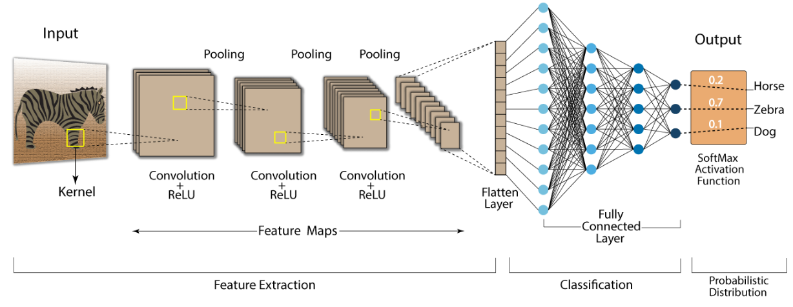]
]
]

???

Ojo con el orden: convolución → padding/stride → activación → pooling
es literalmente el bloque que se repite $n$ veces dentro de cualquier
CNN. Una vez que ese bloque quede claro, el resto de la clase es
apilarlo, entrenarlo y aplicarlo a tareas distintas (clasificar,
detectar, segmentar).

---

class: middle, center, divider-slide

## Parte 0 — Motivación

---

class: smaller

# ¿Por qué no basta una red totalmente conectada?

Una imagen de $224\times224\times3$ tiene $150{,}528$ valores de
entrada. Una sola capa totalmente conectada con $1000$ neuronas ya
necesitaría más de $150$ millones de pesos — **antes de aprender nada
útil**.

Además, una FC .bold[ignora la estructura espacial]: si permutamos los
píxeles de la misma forma en todas las imágenes, a una red FC no le
importaría. Pero sabemos que un borde, una textura o un ojo son
patrones .italic[locales] que se repiten en distintas posiciones de la
imagen.

.alert[La convolución explota exactamente esa estructura: .bold[patrones
locales] que se repiten, mediante dos ideas — .bold[conectividad local]
y .bold[compartición de parámetros] (*weight sharing*).]

???

Vale la pena hacer la cuenta en el pizarrón: $224 \times 224 \times 3 =
150{,}528$. Con $1000$ neuronas de salida en una sola capa FC,
$150{,}528 \times 1000 \approx 150$ millones de parámetros — y eso es
solo la primera capa. Una capa convolucional típica, en cambio, tiene
unos pocos miles de parámetros porque el mismo filtro pequeño se
reutiliza en toda la imagen.

---

class: smaller

# La intuición: campos receptivos locales

.center.width-70[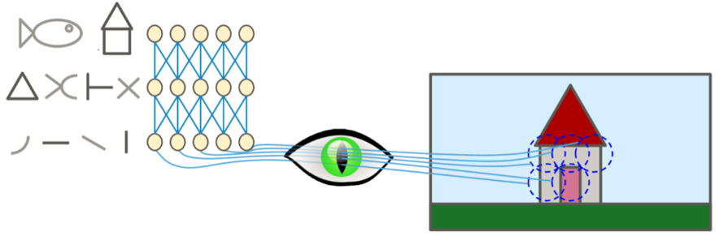]

Igual que la corteza visual (Hubel & Wiesel, 1959): no reconocemos un
objeto mirando el ojo entero de golpe. Reconocemos .bold[partes
locales] —bordes, esquinas, texturas— y las combinamos jerárquicamente
en capas sucesivas hasta llegar al objeto completo.

.alert[Esa jerarquía —bordes → texturas → partes → objetos— es
precisamente lo que aprenderán las capas de una CNN, sin que nadie se lo
programe explícitamente.]

???

Este es el mismo argumento que motivó el slide de "¿cómo creamos las
características?" de la clase pasada. La diferencia es que ahora el
*feature engineering* automático no lo hace una capa oculta genérica,
sino un tipo de capa diseñado específicamente para datos con estructura
espacial: la capa convolucional.

---

class: middle, center, divider-slide

## Parte 1 — Fundamentos matemáticos de la convolución

---

class: smaller

# La operación de convolución

Dada una imagen de entrada $I$ y un kernel (filtro) $K$ de tamaño
$k\times k$, la convolución 2D discreta se define como:

.center.width-60[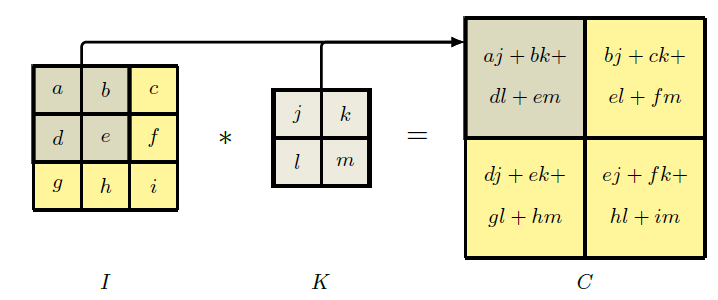]

$$C(i,j) = \sum\_{m=0}^{k-1} \sum\_{n=0}^{k-1} I(i+m,\, j+n)\cdot K(m,n)$$

Cada celda de la salida $C$ es un .bold[producto punto] entre el kernel
y el parche de la imagen que cubre en ese momento.

???

Vale la pena resolver una celda en el pizarrón junto con la figura:
$C(1,1) = aj+bk+dl+em$. Es exactamente el mismo producto punto que
usamos en regresión lineal y en el perceptrón — solo que ahora se repite
en cada posición de la imagen, .bold[con el mismo kernel] cada vez. Ese
"mismo kernel cada vez" es la compartición de parámetros.

---

class: smaller

# Convolución multicanal (imágenes RGB)

Una imagen a color tiene $C\_{in}$ canales (para RGB, $C\_{in}=3$). El
kernel también tiene esa profundidad, y la salida para el canal de
salida $c$ suma sobre todos los canales de entrada:

$$C\_c(i,j) = \sum\_{d=0}^{C\_{in}-1} \sum\_{m=0}^{k-1} \sum\_{n=0}^{k-1} I\_d(i+m,\, j+n)\cdot K\_{c,d}(m,n) \;+\; b\_c$$

- $b\_c$ es el .bold[sesgo] (bias) asociado al filtro $c$.
- Si queremos $C\_{out}$ mapas de características distintos, necesitamos
  $C\_{out}$ kernels independientes, cada uno de tamaño $k\times k\times
  C\_{in}$.

.alert[La salida de una capa convolucional no es una imagen: es un
.bold[volumen] de $C\_{out}$ mapas de características apilados.]

---

class: smaller

# Convolución vs. correlación cruzada

Matemáticamente, la convolución "verdadera" .bold[invierte] el kernel
antes de aplicarlo:

$$(I * K)(i,j) = \sum\_{m}\sum\_{n} I(i-m,\, j-n)\, K(m,n)$$

En la práctica, PyTorch y TensorFlow implementan .bold[correlación
cruzada] — sin invertir el kernel — porque para una red que .italic[aprende]
sus propios pesos da exactamente igual: si hiciera falta invertir el
kernel, la red simplemente aprendería el kernel ya invertido.

.alert[Se le sigue llamando "convolución" por convención histórica, pero
lo que en realidad calcula un framework de deep learning es correlación
cruzada.]

---

class: middle, smaller

# Ejemplo numérico: el filtro *sharpen*

.center.width-70[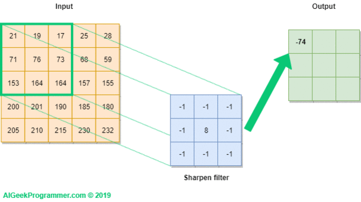]

Kernel *sharpen*:
$$K = \begin{pmatrix} -1 & -1 & -1 \\\\ -1 & 8 & -1 \\\\ -1 & -1 & -1 \end{pmatrix}$$

Para el parche resaltado (valores $21,19,17,71,76,73,153,164,164$):

$$C(0,0) = 8(76) - (21+19+17+71+73+153+164+164) = 608 - 682 = -74$$

.footnote[Créditos de la animación: AIGeekProgrammer.com.]

???

Este es el mismo cálculo del slide anterior, ahora con números reales.
Vale la pena que los estudiantes verifiquen a mano ese $-74$: multiplican
cada valor del parche por el valor correspondiente del kernel y suman
los nueve productos. Es tedioso a mano — y esa es precisamente la razón
por la que se implementa en código (ver Bloque A de ejercicios).

---

class: smaller

# Filtros clásicos de detección de bordes

.grid[
.kol-1-2[
.center.width-100[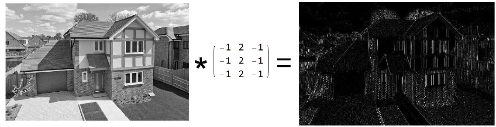]
]
.kol-1-2[
.center.width-100[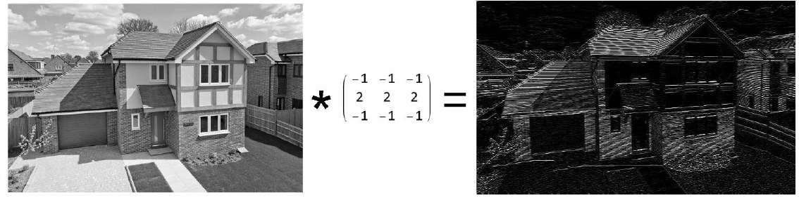]
]
]

Un kernel no siempre se aprende: algunos se .bold[diseñan a mano] para
resaltar un patrón específico. Aquí el mismo kernel, transpuesto,
resalta bordes verticales a la izquierda y horizontales a la derecha.

.alert[Este es el puente conceptual clave: una CNN .bold[aprende] kernels
como estos —y muchos más complejos— en lugar de que un humano los
diseñe a mano.]

---

class: middle, center, divider-slide

## Parte 2 — Padding, Stride y Dimensiones

---

class: smaller

# Padding: por qué agregar ceros alrededor

.center.width-70[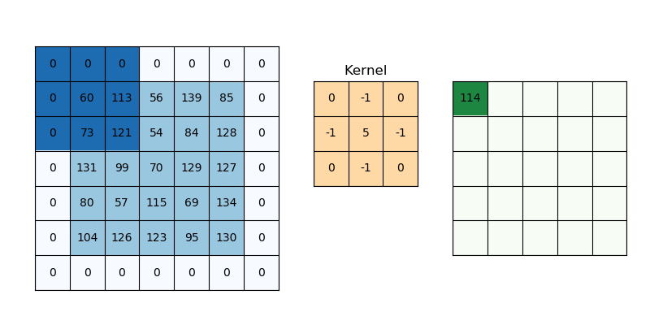]

Sin padding, dos problemas:

- La imagen se .bold[encoge] en cada capa convolucional.
- Los píxeles de las .bold[esquinas y bordes] participan en muchas menos
  convoluciones que los del centro — se subrepresentan.

Se agregan $P$ filas/columnas de ceros alrededor de la entrada. Dos
convenciones:

- .bold[Valid] ($P=0$): sin padding, la salida se reduce.
- .bold[Same]: se ajusta $P$ para que la salida tenga el .italic[mismo
  tamaño] que la entrada.

.footnote[Referencia recomendada: [Zero-Padding in CNNs — Medium](https://dharmarajdhanapal.medium.com/zero-padding-in-convolutional-neural-networks-bf1410438e99)]

???

Con $k=3$ y stride $1$, "same" padding es $P=1$ — se agrega una fila y
una columna de ceros por cada lado. Con $k=5$, sería $P=2$. La regla
rápida para stride $1$: $P = (k-1)/2$.

---

class: smaller

# Stride: el tamaño del salto

El .bold[stride] $S$ es cuánto se desplaza el kernel en cada paso.

- $S=1$: el kernel se desliza .italic[píxel por píxel] — máxima
  resolución de salida.
- $S=2$: el kernel .italic[salta uno] — la salida se reduce a la mitad
  aproximadamente, sin necesidad de una capa de pooling aparte.

.alert[El stride es una forma alternativa de hacer *downsampling*: en
arquitecturas modernas (ResNet) es común usar convoluciones con stride
$2$ en vez de max-pooling para reducir la resolución.]

---

class: middle, smaller

# Fórmula general del tamaño de salida

Para una entrada $W\times W$, kernel $K\times K$, padding $P$ y stride
$S$:

$$O = \left\lfloor \frac{W - K + 2P}{S} \right\rfloor + 1$$

Se aplica igual a alto y ancho (por separado, si la entrada no es
cuadrada).

.grid[
.kol-1-2[
.bold[Ejemplo 1] — entrada $7\times7$, $K=3$, $P=0$, $S=1$:

$$O = \frac{7-3+0}{1}+1 = 5$$

Salida: $5\times5$.
]
.kol-1-2[
.bold[Ejemplo 2] — .italic[same] padding, $K=3$, $P=1$, $S=1$:

$$O = \frac{7-3+2}{1}+1 = 7$$

Salida: $7\times7$ (igual a la entrada).
]
]

???

Un tercer ejemplo útil para el pizarrón: $W=32$, $K=5$, $P=0$, $S=1$
$\Rightarrow O = 28$. Es el caso clásico de LeNet-5 sobre MNIST/CIFAR.
Vale la pena hacer que los estudiantes calculen este a mano antes de
mostrar la respuesta.

---

class: smaller

# Número de parámetros de una capa convolucional

Para una capa con $C\_{in}$ canales de entrada y $C\_{out}$ filtros de
tamaño $K\times K$:

$$\text{Parámetros} = \left(K \times K \times C\_{in} + 1\right) \times C\_{out}$$

El $+1$ es el bias de cada filtro.

.bold[Ejemplo]: capa con entrada de $64$ canales, $128$ filtros de
$3\times3$:

$$(3\times3\times64 + 1)\times128 = (576+1)\times128 = 73{,}856 \text{ parámetros}$$

.alert[Comparen con una capa FC equivalente sobre la misma entrada
aplanada: sería órdenes de magnitud más grande. Esa diferencia es
.bold[weight sharing] en acción.]

---

class: middle, center, divider-slide

## Parte 3 — ReLU y Pooling

---

class: smaller

# La función de activación ReLU

$$\text{ReLU}(x) = \max(0, x)$$

Derivada (la que usa backpropagation):

$$\text{ReLU}'(x) = \begin{cases} 1 & \text{si } x > 0 \\\\ 0 & \text{si } x \le 0 \end{cases}$$

.bold[Ventajas] frente a sigmoide/tanh (vistas en la Clase 7):

- No satura del lado positivo → mitiga el *vanishing gradient*.
- Cómputo trivial: un solo `max`.
- Induce *sparsity*: muchas activaciones quedan exactamente en cero.

.alert[Variantes a conocer: .bold[Leaky ReLU], $\text{LReLU}(x) =
\max(\alpha x,\, x)$ con $\alpha$ pequeño (p. ej. $0.01$) — evita
neuronas "muertas" que siempre dan cero. .bold[GELU], usada en
arquitecturas modernas tipo Transformer.]

???

Conectar con el slide de "Funciones de activación" de la Clase 7:
ReLU no es exclusiva de las CNN, pero es la opción por defecto también
aquí. La única razón para mencionar Leaky ReLU es el problema de
neuronas muertas: si una neurona ReLU cae del lado negativo para todos
los ejemplos de entrenamiento, su gradiente será siempre cero y nunca
se recupera.

---

class: smaller

# Pooling: max y average

Reduce la resolución espacial del mapa de características,
manteniendo la información más relevante.

.grid[
.kol-1-2[
.bold[Max pooling]:

$$P(i,j) = \max\_{(m,n)\,\in\,\text{región}} I(i+m,\, j+n)$$

Conserva la activación .italic[más fuerte] de cada región — típicamente
la más usada en la práctica.
]
.kol-1-2[
.bold[Average pooling]:

$$P(i,j) = \frac{1}{k^2}\sum\_{m=0}^{k-1}\sum\_{n=0}^{k-1} I(i+m,\, j+n)$$

Conserva el .italic[promedio] — más suave, útil en la última capa (ver
GAP).
]
]

El tamaño de salida sigue la .bold[misma fórmula] de la convolución
(el pooling no tiene parámetros aprendibles):

$$O = \left\lfloor \frac{W - K}{S} \right\rfloor + 1$$

---

class: smaller

# Global Average Pooling (GAP)

En vez de aplanar (*flatten*) el último volumen de mapas de
características y conectarlo a una capa FC enorme, GAP colapsa .bold[cada
mapa completo] a un solo número —su promedio—.

$$\text{GAP}(F\_c) = \frac{1}{H\times W}\sum\_{i=1}^{H}\sum\_{j=1}^{W} F\_c(i,j)$$

Si el último volumen tiene $C\_{out}$ canales, GAP produce directamente
un vector de $C\_{out}$ valores — listo para una capa softmax pequeña.

.alert[Ventaja: elimina la capa FC más costosa de la red (recordar que en
VGG-16 la primera FC concentraba .bold[103 millones] de los 138 millones
de parámetros totales). GAP es estándar en ResNet, Inception y
arquitecturas posteriores.]

---

class: middle, center, divider-slide

## Parte 4 — Arquitectura completa de una CNN

---

class: smaller

# El flujo completo, de la imagen a la predicción

.center.width-100[]

$$\text{Input} \;\rightarrow\; \big[\text{Conv} \rightarrow \text{ReLU} \rightarrow \text{Pool}\big] \times n \;\rightarrow\; \text{Flatten (o GAP)} \;\rightarrow\; \text{FC} \;\rightarrow\; \text{Softmax}$$

Dos etapas bien diferenciadas:

- .bold[Extracción de características]: las capas convolucionales
  (aprenden .italic[qué mirar]).
- .bold[Clasificación]: las capas FC + softmax (deciden .italic[a qué
  clase pertenece], igual que en la Clase 7).

---

class: smaller

# El mismo flujo, con vocabulario en español

.center.width-100[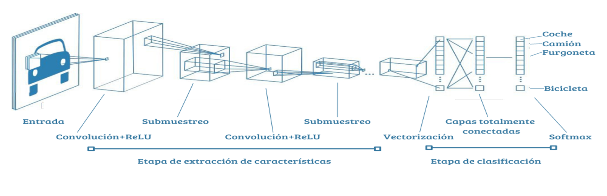]

- .italic[Submuestreo] = pooling.
- .italic[Vectorización] = flatten.
- .italic[Capas totalmente conectadas] = fully connected (FC).

.alert[La salida sigue siendo .bold[softmax], la misma capa de la Clase
7 — nada nuevo ahí. Lo único nuevo hoy es .italic[cómo se construyen las
características] antes de llegar a esa capa final.]

---

class: smaller

# Softmax y la función de pérdida (repaso)

Igual que en la Clase 7, la capa final produce probabilidades:

$$\text{softmax}(z\_i) = \frac{e^{z\_i}}{\sum\_{j=1}^{C} e^{z\_j}}$$

Y se entrena minimizando la .bold[entropía cruzada]:

$$\mathcal{L} = -\sum\_{i=1}^{C} y\_i \log(\hat{y}\_i)$$

donde $y\_i$ es la etiqueta verdadera (codificación *one-hot*) y
$\hat{y}\_i$ la probabilidad predicha para la clase $i$.

.alert[Nada de esto cambió respecto a la Clase 7. Lo que cambió es
.bold[quién produce] los valores $z\_i$ que entran al softmax: ya no una
sola capa FC sobre features manuales, sino toda la pila de capas
convolucionales.]

---

class: middle, smaller

# Ejercicio guiado: calculando dimensiones capa por capa

Aplicando la fórmula $O = \lfloor (W-K+2P)/S \rfloor + 1$ a una red tipo
VGG simplificada:

| Capa | Entrada | Kernel | Stride | Padding | Salida |
|---|---|---|---|---|---|
| Conv1 | $224\times224\times3$ | $3\times3$, 64 filtros | 1 | same | $224\times224\times64$ |
| Pool1 | $224\times224\times64$ | $2\times2$ | 2 | 0 | $112\times112\times64$ |
| Conv2 | $112\times112\times64$ | $3\times3$, 128 filtros | 1 | same | $112\times112\times128$ |
| Pool2 | $112\times112\times128$ | $2\times2$ | 2 | 0 | $56\times56\times128$ |

.alert[Ejercicio en clase: continuar la tabla hasta llegar a la capa FC,
verificando cada fila con la fórmula, y calcular el número total de
parámetros de la red completa (ver Bloque C de ejercicios).]

???

Este ejercicio conecta tres slides anteriores: la fórmula de tamaño de
salida (Parte 2), el conteo de parámetros por capa (Parte 2) y la
arquitectura VGG-16 completa del capítulo base (Bishop, Fig. 10.10),
donde ya vimos que hay ~138 millones de parámetros en total, la mayoría
concentrados en la primera capa FC.

---

class: middle, center, divider-slide

## Parte 5 — Arquitecturas modernas

---

class: smaller

# De LeNet a los Transformers: línea de tiempo

| Arquitectura | Año | Aporte clave |
|---|---|---|
| LeNet-5 | 1998 | Primera CNN práctica (dígitos manuscritos) |
| AlexNet | 2012 | ReLU, dropout, entrenamiento en GPU, ImageNet |
| VGG-16/19 | 2014 | Apilar filtros pequeños ($3\times3$) en profundidad |
| GoogLeNet (Inception) | 2014 | Módulos Inception: convoluciones en paralelo de distinto tamaño |
| .bold[ResNet] | 2015 | .bold[Conexiones residuales] (*skip connections*) |
| EfficientNet | 2019 | Escalado compuesto (profundidad / ancho / resolución) |
| Vision Transformer (ViT) | 2020 | Reemplaza la convolución por atención |

.alert[VGG-16 (la que vimos en el capítulo base) es de .bold[2014]. Todo
lo que viene después de esa fila resuelve una limitación concreta de
apilar capas simplemente más y más profundo.]

???

El punto pedagógico de esta tabla es mostrar que no fue una progresión
lineal de "más capas siempre mejor": VGG-16/19 mostró que apilar filtros
pequeños funciona, pero al intentar ir mucho más profundo (cientos de
capas) el entrenamiento se .italic[degradaba] — no por sobreajuste, sino
porque el gradiente se perdía en el camino. ResNet resuelve exactamente
eso, como veremos en el siguiente slide.

---

class: smaller

# ResNet: el bloque residual

El problema con redes muy profundas: apilar más capas normales
.bold[empeora] el error de entrenamiento (no es sobreajuste — es que el
gradiente se degrada en el camino).

La solución de ResNet: en vez de aprender $F(x)$ directamente, la capa
aprende el .bold[residuo] y se suma la entrada original sin modificar:

$$y = F(x, \{W\_i\}) + x$$

donde $F$ es el mapeo aprendido (conv → BN → ReLU → conv → BN) y $x$
se suma mediante un .italic[atajo de identidad] (*identity shortcut*).

.alert[Si la capa no tiene nada útil que aprender, basta con que
$F(x,\{W\_i\}) \to 0$ y la salida es simplemente $x$: la conexión
residual nunca puede ser .bold[peor] que no tener esa capa. Esto permite
entrenar redes de cientos de capas sin degradación.]

???

Vale la pena dibujar el diagrama del bloque residual en el pizarrón: una
rama principal (conv-BN-ReLU-conv-BN) y una rama de atajo que salta
directo a la suma final, antes de la última ReLU. Es literalmente sumar
un camino "corto" para el gradiente durante backpropagation: la derivada
de $y$ respecto a $x$ incluye el término $+1$ del atajo, que nunca se
anula.

---

class: smaller

# Batch Normalization

Estabiliza y acelera el entrenamiento normalizando las activaciones
.bold[dentro de cada mini-batch]:

$$\hat{x}^{(k)} = \frac{x^{(k)} - \mu\_B}{\sqrt{\sigma\_B^2 + \epsilon}}, \qquad y^{(k)} = \gamma\, \hat{x}^{(k)} + \beta$$

- $\mu\_B$, $\sigma\_B^2$: media y varianza del mini-batch actual.
- $\gamma$, $\beta$: parámetros .bold[aprendibles] que permiten a la red
  deshacer la normalización si le conviene.
- $\epsilon$: constante pequeña para evitar dividir por cero.

.alert[Batch Norm es hoy casi omnipresente en CNNs modernas (incluida
ResNet): reduce la sensibilidad a la tasa de aprendizaje inicial y actúa
como un regularizador leve.]

---

class: middle, center, divider-slide

## Parte 6 — Regularización y buenas prácticas

---

class: smaller

# Cómo evitar el sobreajuste en una CNN

- .bold[Data augmentation]: rotar, voltear, recortar, cambiar
  brillo/contraste de las imágenes de entrenamiento — aumenta la
  variedad efectiva del dataset sin recolectar más datos.
- .bold[Dropout]: apaga aleatoriamente una fracción $p$ de neuronas
  durante el entrenamiento (típico en las capas FC finales).
- .bold[Batch Normalization]: además de acelerar el entrenamiento
  (Parte 5), actúa como regularizador leve.
- .bold[Weight decay (L2)]: penaliza pesos grandes agregando
  $\lambda\lVert\mathbf{w}\rVert^2$ a la función de costo.
- .bold[Early stopping]: detener el entrenamiento cuando el error de
  .italic[validación] deja de mejorar, aunque el de entrenamiento siga
  bajando.

.alert[Ninguna de estas técnicas cambia el modelo $f$ ni la función de
costo $\mathcal{L}$ de fondo — todas actúan .italic[alrededor] del
entrenamiento para que el mínimo que se encuentre generalice mejor.]

---

class: middle, center, divider-slide

## Parte 7 — Transfer Learning

---

class: smaller

# Por qué reutilizar una red ya entrenada

Las primeras capas de una CNN entrenada en un dataset grande (ImageNet,
$1.3$ millones de imágenes, $1000$ clases) aprenden filtros
.bold[genéricos]: bordes, texturas, colores, formas simples.

.center.width-60[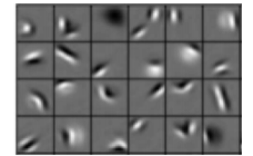]

Esos filtros son .bold[reutilizables] en casi cualquier tarea visual,
aunque el dataset final sea completamente distinto al original (rayos
X, defectos industriales, especies de plantas, etc.).

.alert[Entrenar una CNN grande desde cero requiere millones de imágenes.
Transfer learning permite lograr buenos resultados con .bold[cientos] o
.bold[miles] de imágenes propias.]

---

class: smaller

# Dos estrategias de transfer learning

| Estrategia | Qué se congela | Cuándo usarla |
|---|---|---|
| .bold[Feature extraction] | Toda la red base (solo se entrena el clasificador nuevo) | Dataset propio pequeño, similar al original |
| .bold[Fine-tuning parcial] | Solo las primeras capas; se reentrenan las últimas con *learning rate* bajo | Dataset propio mediano, algo distinto al original |
| .bold[Fine-tuning completo] | Nada — se reentrena todo con LR muy bajo | Dataset grande, muy distinto al dominio original |

.alert[Regla práctica: mientras .bold[más pequeño] sea tu dataset y
.bold[más parecido] al dominio original (fotos naturales), más capas
conviene .italic[congelar].]

???

Vale la pena explicar por qué el *learning rate* debe ser bajo en
fine-tuning: los pesos preentrenados ya están cerca de un buen óptimo
para features genéricos, y un LR alto los "destruiría" rápidamente
(*catastrophic forgetting*), perdiendo toda la ventaja de partir de una
red preentrenada.

---

class: smaller

# Ejemplo práctico propuesto

1. Tomar una red preentrenada en ImageNet (ResNet-18 o VGG-16).
2. Reemplazar la última capa (la que tenía 1000 salidas) por una nueva
   capa softmax con $C$ clases del dataset propio.
3. Entrenar primero solo esa capa nueva (*feature extraction*).
4. Comparar el *accuracy* contra descongelar las últimas dos o tres
   capas convolucionales y reentrenarlas con LR bajo (*fine-tuning*).
5. Comparar ambos resultados contra entrenar la .bold[misma arquitectura
   desde cero] con el mismo dataset pequeño.

.alert[El resultado esperado: entrenar desde cero con pocos datos da el
peor desempeño — es la evidencia más directa de por qué transfer
learning es la práctica estándar en visión por computador.]

---

class: middle, center, divider-slide

## Parte 8 — Visualización e interpretabilidad

---

class: smaller

# Qué aprende la primera capa

.center.width-70[]

Los filtros de la primera capa convolucional son directamente
visualizables como pequeñas imágenes — y se parecen sorprendentemente a
los filtros de Gabor, usados desde hace décadas en procesamiento de
imágenes para detectar bordes orientados.

.alert[Esto .bold[no] implica que la CNN imite la corteza visual: filtros
similares emergen de casi cualquier método estadístico aplicado a
imágenes naturales, porque reflejan las estadísticas de las imágenes
mismas, no un diseño biológico.]

---

class: smaller

# La jerarquía de capas intermedias

.grid[
.kol-1-2[
.center.width-100[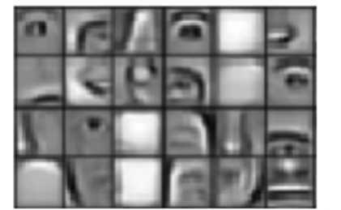]
.center[.italic[Capa intermedia: partes (ojos, texturas)]]
]
.kol-1-2[
.center.width-100[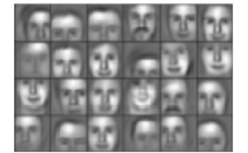]
.center[.italic[Capa profunda: objetos casi completos (rostros)]]
]
]

.alert[Esta es la jerarquía que anticipamos en la Parte 0: bordes
(capa 1) → texturas y partes (capas intermedias) → objetos casi
completos (capas profundas). Nadie programó esta progresión: emergió del
entrenamiento.]

???

Técnica usada para generar estas imágenes: se presentan miles de
parches de un dataset de validación a la red ya entrenada, y para cada
neurona (canal) de una capa se seleccionan los 9 parches que producen la
.bold[activación más alta]. Es una forma de "preguntarle" a cada neurona
qué es lo que más le gusta ver.

---

class: smaller

# Saliency maps y Grad-CAM

Otra pregunta: dada una imagen concreta, .bold[qué región] fue decisiva
para la predicción de la red.

El método .bold[Grad-CAM] calcula, para la clase predicha $c$, el
promedio de las derivadas de la salida $a^{(c)}$ (antes del softmax)
respecto a las activaciones $a\_{ij}^{(k)}$ del último mapa
convolucional $k$:

$$\alpha\_k = \frac{1}{M\_k}\sum\_i\sum\_j \frac{\partial a^{(c)}}{\partial a\_{ij}^{(k)}}$$

Esos promedios ponderan la suma de todos los canales, dando un mapa de
calor del mismo tamaño que la última capa convolucional:

$$\mathbf{L} = \sum\_k \alpha\_k \mathbf{A}^{(k)}$$

.alert[Ese mapa $\mathbf{L}$, superpuesto sobre la imagen original, muestra
exactamente qué región "miró" la red para decidir su predicción — muy
útil para depurar y para explicar decisiones a usuarios no técnicos.]

---

class: smaller

# Ataques adversariales

Los mismos gradientes que entrenan la red pueden usarse para
.bold[engañarla]: modificaciones imperceptibles al ojo humano que causan
una mala clasificación con alta confianza (*fast gradient sign method*):

$$\mathbf{x}' = \mathbf{x} + \epsilon\, \text{sign}\big(\nabla\_{\mathbf{x}} E(\mathbf{x}, t)\big)$$

donde $t$ es la etiqueta verdadera, $E$ el error (p. ej. entropía
cruzada) y $\epsilon$ un paso pequeño que mantiene el cambio
imperceptible.

.alert[El caso clásico: una foto de panda clasificada correctamente con
$57.7\%$ de confianza, tras sumarle un ruido de magnitud $\epsilon=0.007$
(también imperceptible), se clasifica como gibón con $99.3\%$ de
confianza. Existen incluso versiones físicas: señales de alto
modificadas para ser leídas como límites de velocidad por una CNN.]

???

Vale la pena remarcar que esto .bold[no] es un problema de sobreajuste:
una imagen adaptada para engañar a una red suele engañar también a
.italic[otras] redes entrenadas de forma independiente, e incluso a
modelos lineales mucho más simples. Es un fenómeno todavía abierto de
investigación, no un bug puntual de una arquitectura específica.

---

class: middle, center, divider-slide

## Parte 9 — Detección de objetos y YOLO

---

class: smaller

# De clasificar a localizar: bounding boxes

.center.width-70[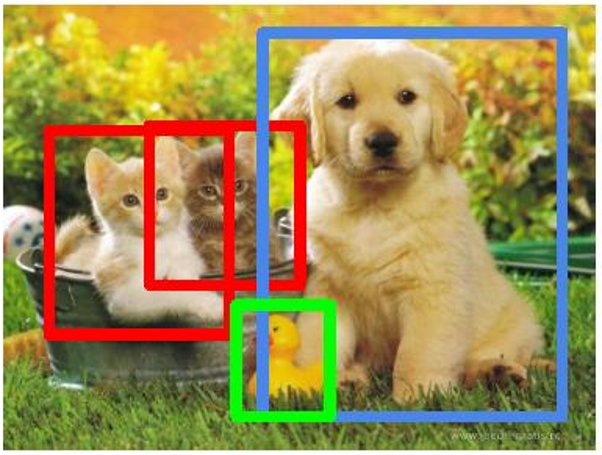]

Un .bold[bounding box] es un rectángulo definido por su centro y sus
dimensiones:

$$\mathbf{b} = (b\_x,\, b\_y,\, b\_W,\, b\_H)$$

Por convención, el origen $(0,0)$ está en la esquina superior izquierda
de la imagen y $(1,1)$ en la esquina inferior derecha (o en píxeles,
según la implementación).

---

class: smaller

# Intersection-over-Union (IoU)

Para medir qué tan bueno es un bounding box predicho respecto al
.italic[ground truth] (etiquetado por un humano):

$$\text{IoU} = \frac{\text{Área}(B\_{pred} \cap B\_{gt})}{\text{Área}(B\_{pred} \cup B\_{gt})}$$

- $\text{IoU} = 1$: coincidencia perfecta.
- $\text{IoU} = 0$: los rectángulos no se superponen.
- En la práctica, se suele considerar una detección .bold[correcta] si
  $\text{IoU} > 0.5$.

.alert[IoU penaliza tanto un box .italic[demasiado grande] (que cubre
área de más) como uno .italic[demasiado pequeño] (que no cubre todo el
objeto) — a diferencia de solo medir el área de superposición.]

---

class: smaller

# Non-max suppression

Al escanear una imagen, es común obtener .bold[múltiples detecciones]
del mismo objeto en posiciones cercanas. El algoritmo:

1. Eliminar todos los boxes cuya probabilidad esté por debajo de un
   umbral (p. ej. $0.7$).
2. Tomar el box de .bold[mayor probabilidad] como detección exitosa.
3. Eliminar cualquier otro box cuyo IoU con ese box exceda un umbral
   (p. ej. $0.5$) — son la misma detección repetida.
4. Repetir con los boxes restantes hasta que todos hayan sido
   declarados exitosos o descartados.

.alert[Esto se aplica .bold[por cada clase por separado]: dos detecciones
superpuestas de clases distintas (p. ej. "perro" y "pelota") .italic[no]
se eliminan entre sí.]

---

class: smaller

# YOLO: You Only Look Once

A diferencia de *sliding window* o R-CNN (que evalúan la red muchas
veces sobre distintas regiones), YOLO trata la detección como .bold[un
único problema de regresión]:

- Divide la imagen en una grilla $S\times S$.
- Cada celda de la grilla predice directamente:

$$\text{Salida por celda} = (b\_x,\, b\_y,\, b\_W,\, b\_H,\, \text{confianza},\, p\_1, \dots, p\_C)$$

- Una .bold[única pasada] por la red produce todas las detecciones de la
  imagen — de ahí el nombre.

.alert[Esto lo hace mucho más rápido que los enfoques de *sliding
window* + CNN completa en cada ventana, al costo de ser algo menos
preciso en objetos muy pequeños o muy juntos entre sí.]

---

class: smaller

# La función de pérdida de YOLO (simplificada)

$$\mathcal{L} = \lambda\_{coord}\sum\_{i}\mathbb{1}\_i^{obj}\Big[(x\_i-\hat{x}\_i)^2+(y\_i-\hat{y}\_i)^2\Big] \;+\; \lambda\_{coord}\sum\_i \mathbb{1}\_i^{obj}\Big[(\sqrt{w\_i}-\sqrt{\hat{w}\_i})^2+(\sqrt{h\_i}-\sqrt{\hat{h}\_i})^2\Big] \;+\; \dots$$

- Primer término: error de .bold[posición] del centro del box.
- Segundo término: error de .bold[tamaño] — nótese la raíz cuadrada,
  que penaliza proporcionalmente menos los errores en boxes grandes que
  en boxes pequeños.
- $\mathbb{1}\_i^{obj}$ vale $1$ solo si hay un objeto en esa celda —los
  términos de coordenadas .bold[no] se penalizan en celdas vacías.
- Términos adicionales (omitidos aquí) penalizan el error de confianza y
  el de clasificación, de forma análoga a la entropía cruzada de la
  Clase 7.

???

No hace falta derivar cada término en detalle; el punto pedagógico es
que sigue siendo la misma receta de siempre —modelo + función de
costo— solo que ahora el "modelo" produce varias salidas numéricas por
celda de la grilla, y el "costo" combina errores de regresión
(posición, tamaño) con errores de clasificación (confianza, clase).

---

class: middle, center, divider-slide

## Parte 10 — Segmentación semántica

---

class: smaller

# De cajas a contornos: segmentación por instancia

.grid[
.kol-1-2[
.center.width-100[]
.center[.italic[Detección: bounding boxes]]
]
.kol-1-2[
.center.width-100[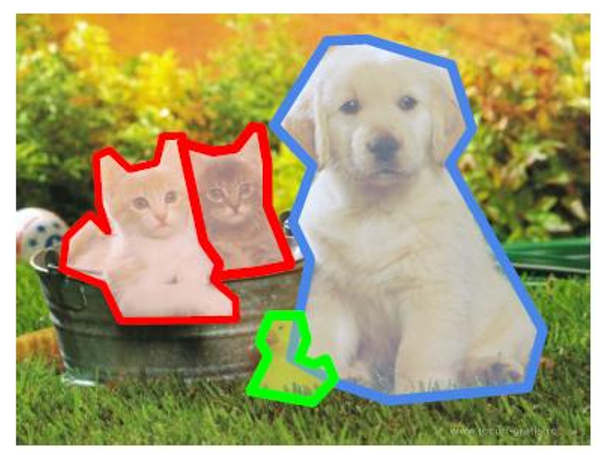]
.center[.italic[Segmentación: contorno exacto de cada instancia]]
]
]

.alert[La segmentación va más allá del rectángulo: asigna una etiqueta a
.bold[cada píxel], distinguiendo la silueta exacta del objeto del fondo
—y, en segmentación por .italic[instancia], distinguiendo también un
perro de otro perro.]

---

class: smaller

# Segmentación semántica: todo pixel tiene una clase

.center.width-100[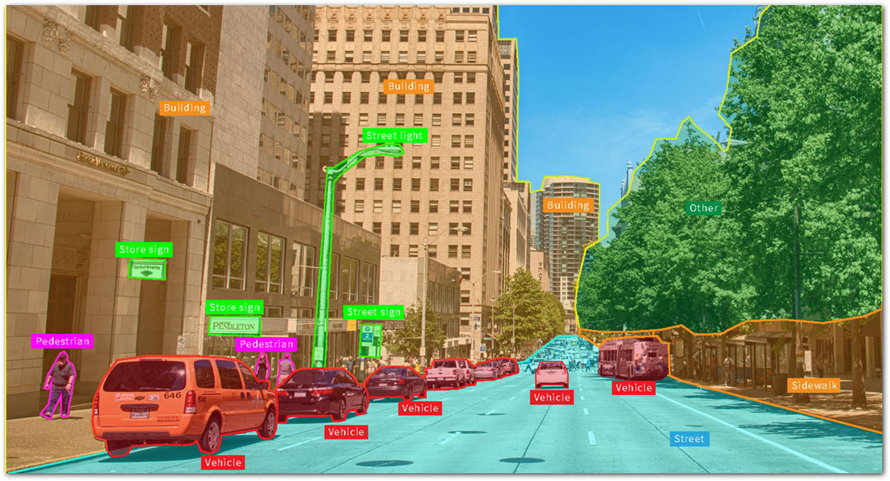]

A diferencia de la clasificación (una etiqueta por imagen), en
segmentación semántica la salida tiene la .bold[misma dimensionalidad]
que la entrada: un mapa de probabilidades por clase, para .bold[cada
píxel].

Si hay $C$ clases, la salida tiene $C$ canales — el píxel se colorea
según la clase de mayor probabilidad.

.alert[Nótese la diferencia con segmentación por .italic[instancia]: aquí
todos los autos comparten la misma etiqueta "Vehicle", sin distinguir un
auto del otro — eso es exactamente lo que sí distinguía el ejemplo
anterior con contornos individuales.]

???

Vale la pena preguntar a la clase: ¿qué arquitectura permite producir
una salida del mismo tamaño que la entrada, después de haber reducido la
resolución con varias capas de pooling? La respuesta —U-Net, con sus
capas de up-sampling y transpose convolution— ya está cubierta en el
material base (Bishop, Sección 10.5) y se puede repasar si el tiempo lo
permite.

---

class: middle, center, divider-slide

## Recursos interactivos

---

class: smaller

# Enlaces para explorar por su cuenta

| Recurso | Uso sugerido |
|---|---|
| [4.1 Convolutions — rramosp](https://rramosp.github.io/2021.deeplearning/content/u4-01-convolutions/) | Repaso matemático interactivo de la convolución |
| [CNN Explainer](https://poloclub.github.io/cnn-explainer/) | Visualización interactiva de una CNN completa, capa por capa |
| [Image Kernels Explained Visually](https://setosa.io/ev/image-kernels/) | Probar distintos kernels (blur, sharpen, edge) en tiempo real |
| [Zero-Padding in CNNs — Medium](https://dharmarajdhanapal.medium.com/zero-padding-in-convolutional-neural-networks-bf1410438e99) | Repaso conceptual de padding |
| [CIFAR Confusion Matrix — ml4a](https://ml4a.github.io/demos/confusion_cifar/) | Explorar errores reales de clasificación de una CNN |
| [AI Geek Programmer — CNN arquitectura parte 2](https://aigeekprogrammer.com/convolutional-neural-network-image-recognition-part-2/) | Repaso de arquitectura con ejemplos numéricos |
| [Analytics Vidhya — Basics of CNN](https://www.analyticsvidhya.com/blog/2022/03/basics-of-cnn-in-deep-learning/) | Repaso introductorio accesible |

.alert[Recomendación de uso en clase: proyectar [CNN Explainer](https://poloclub.github.io/cnn-explainer/) en vivo y subir una foto propia — es la forma más directa de ver todo lo visto hoy funcionando junto.]

---

class: middle, center, divider-slide

## Ejercicios propuestos

---

class: smaller

# Bloque A — Convolución manual con distintos kernels

.center.width-50[]

1. Dada una matriz $5\times5$ (provista en clase), aplicar manualmente:
   - Identidad: $\begin{pmatrix}0&0&0\\\\0&1&0\\\\0&0&0\end{pmatrix}$
   - *Sharpen*: $\begin{pmatrix}0&-1&0\\\\-1&5&-1\\\\0&-1&0\end{pmatrix}$
   - *Blur* (promedio): $\frac{1}{9}\begin{pmatrix}1&1&1\\\\1&1&1\\\\1&1&1\end{pmatrix}$
   - Sobel vertical y horizontal.
   - Calcular a mano al menos 2 celdas de salida; verificar el resto con
     `scipy.signal.convolve2d`.
2. Repetir con [Image Kernels Explained Visually](https://setosa.io/ev/image-kernels/) sobre una foto propia y comparar contra el cálculo manual.

---

class: smaller

# Bloque B — Padding y stride

.center.width-40[]

3. Para una imagen $10\times10$, calcular el tamaño de salida con:
   - $K=3,\ S=1,\ P=0$
   - $K=3,\ S=2,\ P=1$
   - $K=5,\ S=1,\ P=2$ (*same* padding)

   Verificar cada resultado con $O = \lfloor (W-K+2P)/S \rfloor + 1$ y
   con código.

4. Implementar en NumPy una función `conv2d(image, kernel, stride,
   padding)` desde cero (sin librerías de deep learning) y validarla
   contra `scipy.signal.convolve2d`.

---

class: smaller

# Bloque C — Arquitectura y dimensiones

5. Completar la tabla de dimensiones de la Parte 4 (Ejercicio guiado)
   hasta la capa de salida, y calcular el .bold[número total de
   parámetros] de la red completa usando

   $$\text{Parámetros} = \left(K \times K \times C\_{in} + 1\right) \times C\_{out}$$

   para cada capa convolucional.

---

class: smaller

# Bloque D — Visión práctica con CNN entrenada

.center.width-30[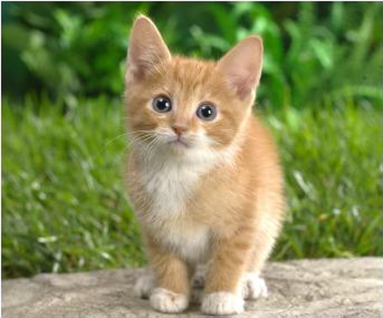]

6. Cargar una CNN preentrenada (ResNet-18 de `torchvision`) y
   clasificar 5 imágenes propias. Visualizar los mapas de activación de
   la primera capa convolucional (comparar con la Figura 6 de esta
   clase).
7. Explorar [CNN Explainer](https://poloclub.github.io/cnn-explainer/), subiendo una imagen propia y observando cómo cambian las activaciones capa por capa.

---

class: smaller

# Bloque E — Transfer learning

8. Tomar un dataset pequeño (p. ej. 200 imágenes, 2 clases) y entrenar
   un clasificador usando .bold[feature extraction] sobre una red
   preentrenada.
9. Comparar el *accuracy* contra entrenar la .bold[misma red desde
   cero] con el mismo dataset pequeño. Reportar la diferencia y
   explicarla con lo visto en la Parte 7.

---

class: smaller

# Bloque F — YOLO y detección de objetos

.center.width-45[]

10. Ejecutar YOLOv8 (Ultralytics, modelo preentrenado) sobre un video o
    conjunto de fotos propias. Reportar clases detectadas, confianza y
    bounding boxes.
11. Modificar el umbral de confianza y el umbral de IoU de non-max
    suppression; observar y explicar cómo cambian las detecciones.
12. Comparar cualitativamente el resultado de YOLO contra el enfoque de
    *sliding window* + non-max suppression visto en el material base.

---

class: smaller

# Bloque G — Análisis de errores

13. Usando [CIFAR Confusion Matrix](https://ml4a.github.io/demos/confusion_cifar/), identificar qué clases se confunden más entre sí y proponer una hipótesis de por qué (basada en similitud visual de bajo nivel: bordes, texturas, color — conectar con la Parte 8).

---

class: smaller

# Resumen

- Una CNN reemplaza la conectividad total de una FC por .bold[conectividad
  local] y .bold[compartición de parámetros] — la misma neurona (kernel)
  se aplica en toda la imagen.
- La convolución produce, para cada posición, un .bold[producto punto]
  entre el kernel y el parche de la imagen: $C(i,j) = \sum\_m\sum\_n
  I(i+m,j+n)K(m,n)$.
- .bold[Padding] evita que la imagen se encoja y que los bordes se
  subrepresenten; .bold[stride] controla el tamaño del salto. El tamaño
  de salida siempre es $O = \lfloor (W-K+2P)/S \rfloor + 1$.
- .bold[ReLU] sigue siendo la activación por defecto; .bold[pooling]
  (max o average) reduce la resolución espacial y aporta invariancia a
  pequeñas traslaciones.
- La arquitectura completa repite $[\text{Conv}\to\text{ReLU}\to\text{Pool}]$
  varias veces y termina igual que la Clase 7: FC + softmax + entropía
  cruzada.
- .bold[ResNet] resolvió la degradación de redes muy profundas con
  conexiones residuales $y = F(x) + x$; .bold[Batch Norm] estabiliza el
  entrenamiento.
- .bold[Transfer learning] reutiliza filtros genéricos aprendidos en
  ImageNet — la práctica estándar cuando el dataset propio es pequeño.
- Grad-CAM y los ataques adversariales muestran que se puede —y a veces
  se debe— mirar .italic[dentro] de la red, no solo confiar en su
  *accuracy*.
- .bold[YOLO] convierte la detección en un problema de regresión de una
  sola pasada; la .bold[segmentación semántica] lleva la predicción a
  nivel de píxel.

---

class: middle, center, end-slide
count: false

## Fin de la Clase 8

Próxima clase: Redes Neuronales Recurrentes (RNN) y Modelos de Secuencia
